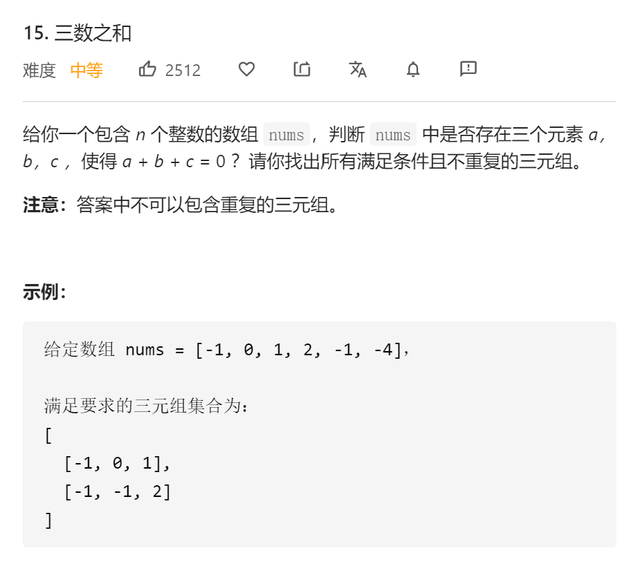

## [题目描述](https://leetcode-cn.com/problems/3sum/)

找出数组中三数之和为0的所有可能组合，并且不能有重复的结果。



## 解法

- 先排序
- 双指针，注意排除重复的结果

```java
class Solution {
    public List<List<Integer>> threeSum(int[] nums) {
        List<List<Integer>> result = new ArrayList<List<Integer>>();
        int size = nums.length;
        Arrays.sort(nums);

        if (size < 3 || nums == null) return result;

        for (int i = 0; i < size-2; i++) {
            int indexLeft = i + 1, indexRight = size - 1;
            if (nums[i] > 0) return result;
            if (i-1 >= 0 && nums[i] == nums[i-1]) continue;

            while (indexLeft < indexRight) {
                if (nums[i] + nums[indexLeft] + nums[indexRight] == 0) {
                    while (nums[indexLeft] == nums[indexLeft+1] && indexLeft + 1 < indexRight) indexLeft++;
                    while (nums[indexRight] == nums[indexRight-1] && indexRight - 1 > indexLeft) indexRight--;
                    result.add(Arrays.asList(nums[i], nums[indexLeft], nums[indexRight]));
                    indexLeft++;
                    indexRight--;
                } else if(nums[i] + nums[indexLeft] + nums[indexRight] > 0) {
                    indexRight--;
                } else indexLeft++;
            }
        }
        return result;
    }
}
```