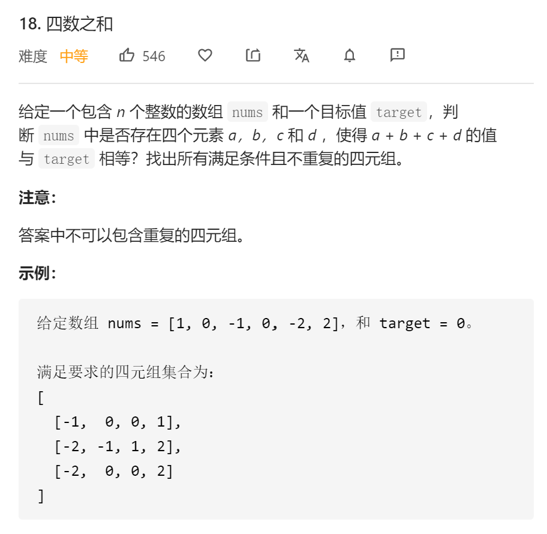

## 题目描述




## 解法

```java
class Solution {
    public List<List<Integer>> fourSum(int[] nums, int target) {
        List<List<Integer>> result = new ArrayList<>();
        if (nums == null || nums.length < 4) {
            return result;
        }
        Arrays.sort(nums);
        int minValue = nums[0] + nums[1] + nums[2] + nums[3];
        int maxValue = nums[nums.length - 1] + nums[nums.length - 2] + nums[nums.length - 3] + nums[nums.length - 4];

        if (minValue > target || maxValue < target) {
            return result;
        }
        for (int i = 0; i < nums.length - 3; i++) {
            if (i > 0 && nums[i] == nums[i - 1]) {
                continue;
            }
            for (int j = i + 1; j < nums.length - 2; j++) {
                if (j > i + 1 && nums[j] == nums[j - 1]) {
                    continue;
                }
                int left = j + 1;
                int right = nums.length - 1;
                minValue = nums[i] + nums[j] + nums[left] + nums[left + 1];
                maxValue = nums[i] + nums[j] + nums[right] + nums[right - 1];
                if (minValue > target || maxValue < target) {
                    continue;
                }
                while (left < right) {
                    int temp = nums[left] + nums[right] + nums[i] + nums[j];
                    if (temp == target) {
                        List<Integer> l = new ArrayList<>(Arrays.asList(nums[i], nums[j], nums[left], nums[right]));
                        result.add(l);
                        while (left < right && nums[left] == nums[left + 1]) {
                            left++;
                        }
                        while (left < right && nums[right] == nums[right - 1]) {
                            right--;
                        }
                        left++;
                        right--;
                    } else if (temp > target) {
                        right--;
                    } else {
                        left++;
                    }
                }
            }
        }
        return result;
    }
}
```