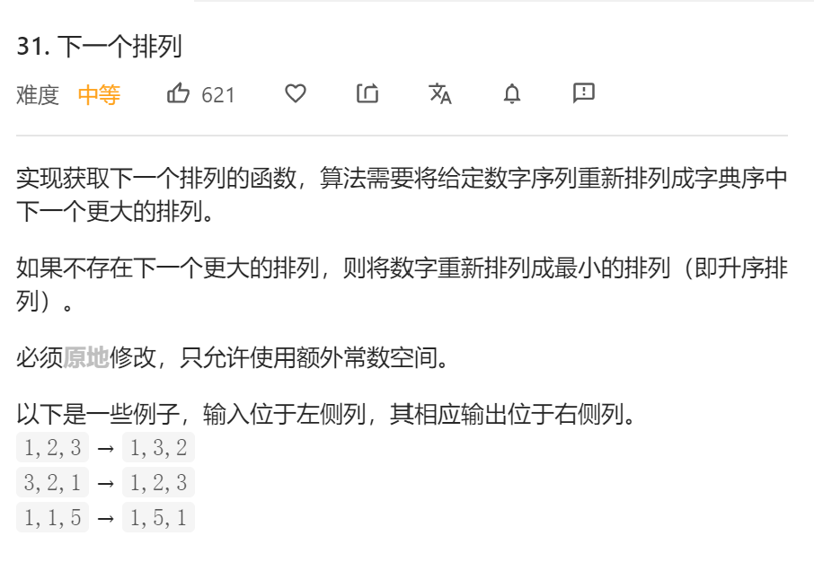

## 题目描述

给定一个数组，数组按照排列对应一个数字，让你修改数组的排列使得新的数大于原来的数，同时还要满足刚好大于的条件。

如果原来的数字已经是最大值，那么新生成的数是最小值。



## 解法

- 下标i从后往前遍历, 然后再往后遍历
- 交换
- 逆序

```java
class Solution {
    public void nextPermutation(int[] nums) {
        int size = nums.length;
        boolean flag = false;
        for(int i = size-1; i > 0; i--) {
            int j = i-1;
            if(nums[i]>nums[j]){
                flag = true;
                int k = i;
                while((++k<size) && (nums[k]>nums[j])){}
                exch(nums, k-1, j);
                for(int l=i;l<i+(size-i)/2;l++){
                    exch(nums, l, size-1-(l-i));
                }
                //exch(nums, i, size-1);
                return;
            }
        }
        if(!flag){
            for(int i = 0; i<size/2; i++){
                exch(nums, i, size-i-1);
            }
        }
        return;
    }

    private void exch(int[] nums, int i, int j){
        int temp = nums[i];
        nums[i] = nums[j];
        nums[j] = temp;
    }
}
```

合并一些交换的步骤

```java
class Solution {
    public void nextPermutation(int[] nums) {
        int size = nums.length;
        int ll = 0;
        for(int i = size-1; i > 0; i--) {
            int j = i-1;
            if(nums[i]>nums[j]){
                int k = i;
                ll=i;
                while((++k<size) && (nums[k]>nums[j])){}
                exch(nums, k-1, j);
                break;
            }
        }

        for(int l=ll;l<ll+(size-ll)/2;l++){
            exch(nums, l, size-1-(l-ll));
        }
    }

    private void exch(int[] nums, int i, int j){
        int temp = nums[i];
        nums[i] = nums[j];
        nums[j] = temp;
    }
}
```

参考解法

```java
public class Solution {
    public void nextPermutation(int[] nums) {
        int i = nums.length - 2;
        while (i >= 0 && nums[i + 1] <= nums[i]) {
            i--;
        }
        if (i >= 0) {
            int j = nums.length - 1;
            while (j >= 0 && nums[j] <= nums[i]) {
                j--;
            }
            swap(nums, i, j);
        }
        reverse(nums, i + 1);
    }

    private void reverse(int[] nums, int start) {
        int i = start, j = nums.length - 1;
        while (i < j) {
            swap(nums, i, j);
            i++;
            j--;
        }
    }

    private void swap(int[] nums, int i, int j) {
        int temp = nums[i];
        nums[i] = nums[j];
        nums[j] = temp;
    }
}

作者：LeetCode
链接：https://leetcode-cn.com/problems/next-permutation/solution/xia-yi-ge-pai-lie-by-leetcode/
来源：力扣（LeetCode）
著作权归作者所有。商业转载请联系作者获得授权，非商业转载请注明出处。
```